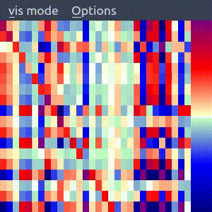
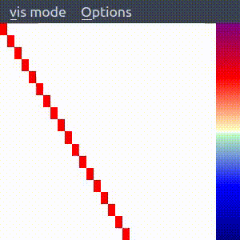
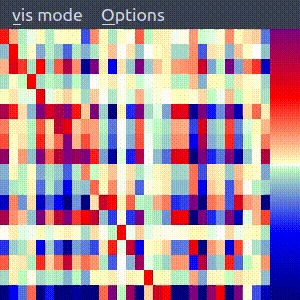
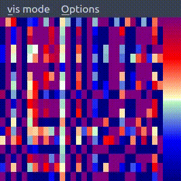
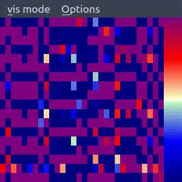

# DEPNEW

DEP new rules rethink:

With extra information on the rules
With better smoothing on the robot sensors/motors
Adding more explainations in relation to dynamics


# Git COMMANDS:

``` git add . ```

```git commit -m "adding changeable terrain map for exploration and adaption in the complex terrain"```

``` git push -u origin main ```


# Reference 

1. using the learning rules from the paper 

DEP rule: https://www.pnas.org/content/112/45/E6224

Supplementary materials: playfulmachines.com/DEP  (Ralf Der et al)

2. using the diamond structure introduced here:

DIAMOND rule: https://www.frontiersin.org/articles/10.3389/fnbot.2020.00062/full   (Simon et al)

3. Simulator: 

Lpzrobot software: https://github.com/georgmartius/lpzrobots  (Georg Martius et al)

Installation Scripts: https://github.com/larsgroeber/lpzrobots-install-script


<!-- ## Matrix plot

M, Lambda, B, C_update, C

* **M**
  
  

* **Lambda**

    Seems to be very very large.

  


* **B**
  
    B and C looks okay.

  

* **C_update**
  
  

* **C**
  
   -->


## uC Matrix Evaluations


**uC when Lambda_update_interval = 1**     |  **Lambda_update_interval = 2**
:-----------------------------------:|:-------------------------------------------:
                  |  


**Lambda_update_interval = 3**      |  **Lambda_update_interval = 4**
:-----------------------------------:|:-------------------------------------------:
                  |  


**Lambda_update_interval = 5**      |  **Lambda_update_interval = 10**
:-----------------------------------:|:-------------------------------------------:
                  |  


We see that when Lambda_update_interval=1 and **synboost=1.0**, the **uC (updateC)** matrix is an unit matrix, then as the Lambda_update_interval goes up, the uC matrix goes far away from an unit matrix, but still from 2-4, we can also see sometimes it perserves an unit matrix.

<br/><br/>
